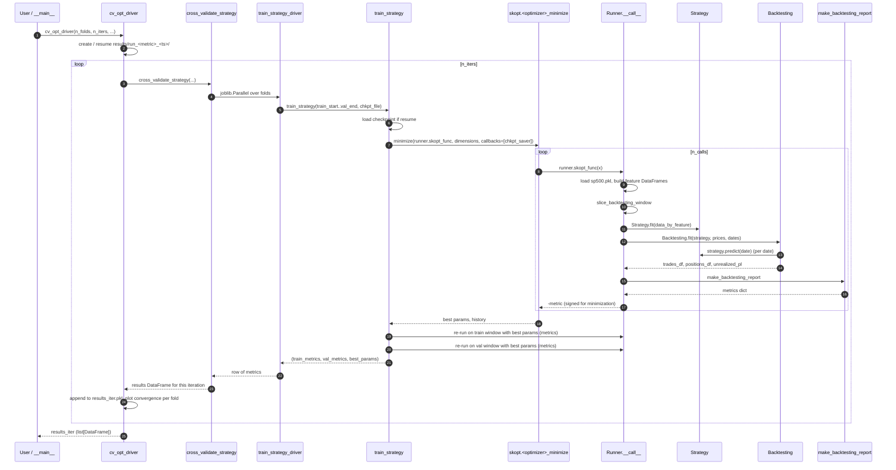

# Architecture

This document traces the full control flow of a tuning run, from the top-level entry point down through the backtester. The codebase is small but the call chain spans six files, so this is the easiest way to get oriented.

## High-level layers

```
┌───────────────────────────────────────────────────────────────────┐
│  cv_opt_driver           ← user-facing tuning driver              │
│    ↳ cross_validate_strategy                                      │
│        ↳ train_strategy_driver   (one per CV fold, joblib)        │
│            ↳ train_strategy                                       │
│                ↳ skopt.<optimizer>_minimize(runner.skopt_func)    │
│                    ↳ Runner.__call__                              │
│                        ↳ Strategy.fit / predict                   │
│                        ↳ Backtesting.fit                          │
│                        ↳ make_backtesting_report                  │
└───────────────────────────────────────────────────────────────────┘
```

Each layer has one responsibility:

| Layer | File | Responsibility |
|---|---|---|
| Data ingest | `exp/data_getter.py` | yfinance pulls per ticker, locally compute `adjusted_close`, pickle to `data/sp500.pkl` |
| Tuning driver | `exp/optimization.py` | Multi-round CV loop, log/checkpoint/resume, convergence plots |
| Cross-validation | `exp/optimization.py` | Build walk-forward folds, parallelize via joblib |
| Single-fold trainer | `exp/optimization.py` | One Bayesian-opt run + best-params evaluation on val window |
| Bayesian optimizer | `scikit-optimize` | Propose hyperparameters, track convergence, save checkpoints |
| Strategy runner | `exp/strategy/<name>.py` | Load data, build a strategy with one hyperparameter point, run backtest, return a metric |
| Strategy | `exp/strategy/<name>.py` | Convert features into a date-indexed list of holdings |
| Backtester | `exp/backtesting.py` | Replay holdings, simulate fills, track balance and P&L |
| Reporting | `exp/reporting.py` | Compute realized/annualized/Sharpe/Sortino + plots |

## Sequence diagram — one HPO iteration



## What "walk-forward CV" looks like

Given `val_start_date`, `train_window_size`, `val_window_size`, and `n_folds`, fold `i` covers:

```
train: [val_start_date + i*val_window - train_window,  val_start_date + i*val_window]
val:   [val_start_date + i*val_window,                  val_start_date + (i+1)*val_window]
```

So validation windows are contiguous (no overlap, no gap) and the training window slides with them. There's no gap/embargo between train and val — be aware if you add a strategy whose features leak across the boundary.

## Resume semantics

There are two independent levels of resume:

1. **Per-fold (`train_strategy`)** — if `chkpt_file` exists and `resume=True`, skopt seeds itself with the prior `x_iters` / `func_vals` and runs `n_random_starts=0`. Set by `cv_opt_driver` for every iteration *after* the first.
2. **Per-run (`cv_opt_driver`)** — `resume=True` picks the most recent `results/run_<metric>_*/` dir; `resume="<dir_name>"` picks a specific one. It loads `results_iter.pkl` and continues iteration numbering from there. Combined with (1), this means resuming a run will pick up exactly where it stopped, both at the iteration level and within each fold's skopt history.

## Where state lives during a run

Inside `results/run_<metric>_<timestamp>/`:

```
cv_opt.log                                       # full log stream (stdout + file)
checkpoint_<train_start>_<train_end>_<metric>.pkl  # one per fold; skopt CheckpointSaver output
results_iter.pkl                                 # list[DataFrame], one per iteration; drives resume + plots
fold_<NN>.png                                    # convergence plot per CV fold
unrealized_pl__<params>.png                      # per-evaluation P&L plot (only when verbose=True)
```

## Adding a new strategy

To plug a new strategy into this same control flow:

1. Create `exp/strategy/<name>.py` with two classes that match the existing contract (see [data_schema.md](data_schema.md) for input/output shapes):
   - `<Name>Strategy` — `fit(data_by_feature)`, `predict(date)`, `get_dates()`, attribute `price_min`.
   - `<Name>Runner` — `__init__(start_date_requested, end_date_requested, max_lookback, ...)`, `__call__(**hyperparams)`, attribute `dimensions: OrderedDict[str, skopt.space.*]`, attribute `signs: dict[metric -> ±1]`, method `skopt_func(x)`.
2. Pass `StrategyRunner=<Name>Runner` to `cv_opt_driver`. Nothing else changes.

See [hpo_notes.md](hpo_notes.md) for guidance on picking the search space.
